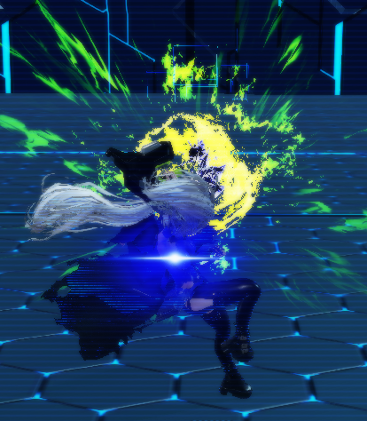
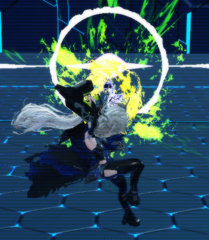
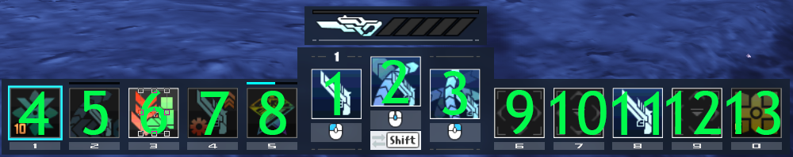
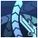
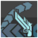

```{raw} html
<noscript><div style="padding-top: 1.9em; position: fixed;top: 0;left: 0;width: 100%;z-index: 101;text-align: center;font-weight: bold;color: #FFF;background-color: #AE0000;padding: 5px 0 5px 0;"><p>
  Please activate JavaScript, this page does not work properly without it enabled.
</p></div></noscript>
```

# Moveset
Slayer has many attacks available for use in combat. This page aims to show and explain their use cases. To make the following tables easier to read we will use some abbreviations, you can hover over them to if you do not know what they mean.

```{important}
* Potency values are floored and {term}`DPS` values are rounded in calculations.

* {term}`DPS` values of {term}`PA`s include [RB](./skill-tree.md#relentless-blade), [RBR](./skill-tree.md#relentless-blade-reinforce) and Class specific Critical Hit Rate multipliers.

* Focus Multiplier against Bosses is 5 and is included in the Focus per second calculation

* Rage Multiplier against Bosses is 3 and is included in the Rage per second calculation

More accurate and up-to-date information can be found in [Frame Data](#frame-data).
```


##  Relentless Blade
During a {term}`PA`, a purple glow will appear on your character.
When using a [Normal Attack](#normal-attack) while the glow is visible, you will do an additional [hitscan](https://en.wikipedia.org/wiki/Hitscan) attack that builds Focus, Rage and recovers some {term}`PP`.
```{hint}
The skill [Relentless Blade Reinforce](./skill-tree.md#relentless-blade-reinforce) will increase the potency of this attack.
```

Purple Glow during a {term}`PA`



When successfully executing [Relentless Blade](./skill-tree.md#relentless-blade) another visual indicator will appear.



```{csv-table}
---
header: >
  "Variant", "Potency", "{term}`PP` Gain", "Focus", "Rage"
widths: 5, 5, 5, 5, 5
align: center
---
"Weak w/ [RBR](./skill-tree.md#relentless-blade-reinforce)", "RB_Pot", "RB_PP", "RB_Focus", "RB_Rage"
"Weak w/o [RBR](./skill-tree.md#relentless-blade-reinforce)", "RB_NoRBR_Pot", "RB_PP", "RB_Focus", "RB_Rage"
"Strong w/ [RBR](./skill-tree.md#relentless-blade-reinforce)", "RB_Strong_Pot", "RB_Strong_PP", "RB_Strong_Focus", "RB_Strong_Rage"
"Strong w/o [RBR](./skill-tree.md#relentless-blade-reinforce)", "RB_Strong_NoRBR_Pot", "RB_Strong_PP", "RB_Strong_Focus", "RB_Strong_Rage"
```

```{hint}
Strong [Relentless Blade](./skill-tree.md#relentless-blade) only occurs during [Stay Arts Flowing Sirius Stage 2](#sfs12).
```

### Making [RB](./skill-tree.md#relentless-blade) Easier
Some may find the window of [Relentless Blade](./skill-tree.md#relentless-blade) difficult. To make things easier, you may change the location of your [Normal Attack](#normal-attack) button. There is a priority system for inputs.The game will process actions with a lower priority value first. The priority values are as follows:



Binding the [Normal Attack](#normal-attack) button to a slot with lower priority allows you to hold down both a {term}`PA` and a [Normal Attack](#normal-attack) to automatically activate [Relentless Blade](./skill-tree.md#relentless-blade) without canceling into [Slug Shot](./skill-tree.md#slug-shot) or a [Normal Attack](#normal-attack).

Here is an example of me binding [Normal Attack](#normal-attack) to Slot 6 of my Sub Palette which has a priority value of 9, while I am using a {term}`PA` on my Weapon Palette with a priority value of 2.

```{raw} html
<div class="wrapper" style="--aspect-ratio:160/90"><video class="lozad" autoplay muted loop playsinline>
  <source data-src="_static/PA/EasyRB.webm" type="video/webm">
</video></div>
```

## Photon Arts
Slayer {term}`PA`s change depending on if a directional input was pressed upon activation of the {term}`PA`.

If you are familiar with the Fighter Class, you might notice a similarity with Fighter Skip Arts.

```{tip}
Cancelling a {term}`PA` with a Step Dodge- is more generous than cancelling with a Weapon Action input, so if you find yourself stuck in some {term}`PA`s consider using a [Step Counter](#stepc-wa) instead.
```

###  Shifting Spica
(sSS)=
#### {term}`sSS`
Stay Arts Shifting Spica will perform a forward slash and fire a Photon Bullet in quick succession.
```{hint}
This {term}`PA` will grant you super armor throughout the entire duration.
```

```{raw} html
<div class="wrapper" style="--aspect-ratio:160/90"> <video class="lozad" autoplay muted loop playsinline>
  <source data-src="_static/PA/sSS.webm" type="video/webm">
</video></div>
```

```{csv-table}
---
header: >
  "Potency", "Time (s)", "{term}`F0` {term}`DPS`", "{term}`F5` {term}`DPS`", "{term}`OD` {term}`DPS`", "{term}`PP` Cost", "Focus", "Rage", "Focus/s", "Rage/s"
widths: 5, 5, 5, 5, 5, 5, 5, 5, 5, 5
align: center
---
"sSS_Pot", "sSS_Time", "sSS_F0", "sSS_F5", "sSS_OD", "sSS_PP", "sSS_Focus", "sSS_Rage", "sSS_FPS", "sSS_RPS"
```

(mSS)=
#### {term}`mSS`
Move Arts Shifting Spica will approach the enemy at high speed with a thrust attack then shoot at close range.
```{hint}
This {term}`PA` will grant you super armor throughout the entire duration.
```

```{raw} html
<div class="wrapper" style="--aspect-ratio:160/90"><video class="lozad" autoplay muted loop playsinline>
  <source data-src="_static/PA/mSS.webm" type="video/webm">
</video></div>
```

```{csv-table}
---
header: >
  "Potency", "Time (s)", "{term}`F0` {term}`DPS`", "{term}`F5` {term}`DPS`", "{term}`OD` {term}`DPS`", "{term}`PP` Cost", "Focus", "Rage", "Focus/s", "Rage/s"
widths: 5, 5, 5, 5, 5, 5, 5, 5, 5, 5
align: center
---
"mSS_Pot", "mSS_Time", "mSS_F0", "mSS_F5", "mSS_OD", "mSS_PP", "mSS_Focus", "mSS_Rage", "mSS_FPS", "mSS_RPS"
```

###  Flowing Sirius
(sFS1)=
#### {term}`sFS1`
Stay Arts Flowing Sirius will perform a series of slashes. When activated in succession, it turns into a powerful attack.

```{raw} html
<div class="wrapper" style="--aspect-ratio:160/90"><video class="lozad" autoplay muted loop playsinline>
  <source data-src="_static/PA/sFS1.webm" type="video/webm">
</video></div>
```

```{csv-table}
---
header: >
  "Potency", "Time (s)", "{term}`F0` {term}`DPS`", "{term}`F5` {term}`DPS`", "{term}`OD` {term}`DPS`", "{term}`PP` Cost", "Focus", "Rage", "Focus/s", "Rage/s"
widths: 5, 5, 5, 5, 5, 5, 5, 5, 5, 5
align: center
---
"sFS1_Pot", "sFS1_Time", "sFS1_F0", "sFS1_F5", "sFS1_OD", "sFS1_PP", "sFS1_Focus", "sFS1_Rage", "sFS1_FPS", "sFS1_RPS"
```

(sfs12)=
#### {term}`sFS12`
Stage 2 of Stay Arts Flowing Sirius turns the {term}`PA` into a powerful Attack.
```{hint}
Stage 2 of this {term}`PA` has an increased potency on [RB](./skill-tree.md#relentless-blade) and will grant you super armor.
```

```{raw} html
<div class="wrapper" style="--aspect-ratio:160/90"><video class="lozad" autoplay muted loop playsinline>
  <source data-src="_static/PA/sFS12.webm" type="video/webm">
</video></div>
```

```{csv-table}
---
header: >
  "Potency", "Time (s)", "{term}`F0` {term}`DPS`", "{term}`F5` {term}`DPS`", "{term}`OD` {term}`DPS`", "{term}`PP` Cost", "Focus", "Rage", "Focus/s", "Rage/s"
widths: 5, 5, 5, 5, 5, 5, 5, 5, 5, 5
align: center
---
"sFS12_Pot", "sFS12_Time", "sFS12_F0", "sFS12_F5", "sFS12_OD", "sFS12_PP", "sFS12_Focus", "sFS12_Rage", "sFS12_FPS", "sFS12_RPS"
```

(mFS)=
#### {term}`mFS`
Move Arts Flowing Sirius will perform an attack that sweeps the surrounding area while moving.
```{hint}
This {term}`PA` will grant you super armor until before performing the last slash of the attack.
```

```{raw} html
<div class="wrapper" style="--aspect-ratio:160/90"><video class="lozad" autoplay muted loop playsinline>
  <source data-src="_static/PA/mFS.webm" type="video/webm">
</video></div>
```

```{csv-table}
---
header: >
  "Potency", "Time (s)", "{term}`F0` {term}`DPS`", "{term}`F5` {term}`DPS`", "{term}`OD` {term}`DPS`", "{term}`PP` Cost", "Focus", "Rage", "Focus/s", "Rage/s"
widths: 5, 5, 5, 5, 5, 5, 5, 5, 5, 5
align: center
---
"mFS_Pot", "mFS_Time", "mFS_F0", "mFS_F5", "mFS_OD", "mFS_PP", "mFS_Focus", "mFS_Rage", "mFS_FPS", "mFS_RPS"
```

###  Reaping Regulus
(sRR)=
#### {term}`sRR`
Stay Arts Reaping Regulus will throw a photon bomb while retreating back as the photon bomb explodes.
```{hint}
This {term}`PA` will grant you invincibility frames and super armor for 0.35 seconds after using.
```

```{raw} html
<div class="wrapper" style="--aspect-ratio:160/90"><video class="lozad" autoplay muted loop playsinline>
  <source data-src="_static/PA/sRR.webm" type="video/webm">
</video></div>
```

```{csv-table}
---
header: >
  "Potency", "Time (s)", "{term}`F0` {term}`DPS`", "{term}`F5` {term}`DPS`", "{term}`OD` {term}`DPS`", "{term}`PP` Cost", "Focus", "Rage", "Focus/s", "Rage/s"
widths: 5, 5, 5, 5, 5, 5, 5, 5, 5, 5
align: center
---
"sRR_Pot", "sRR_Time", "sRR_F0", "sRR_F5", "sRR_OD", "sRR_PP", "sRR_Focus", "sRR_Rage", "sRR_FPS", "sRR_RPS"
```

(mRR)=
#### {term}`mRR`
Move Arts Reaping Regulus will kick the bomb in a curved manner that explodes a certain distance away.
```{hint}
This {term}`PA` will grant you invincibility frames for 0.2 seconds after using.
```

```{raw} html
<div class="wrapper" style="--aspect-ratio:160/90"><video class="lozad" autoplay muted loop playsinline>
  <source data-src="_static/PA/mRR.webm" type="video/webm">
</video></div>
```

```{csv-table}
---
header: >
  "Potency", "Time (s)", "{term}`F0` {term}`DPS`", "{term}`F5` {term}`DPS`", "{term}`OD` {term}`DPS`", "{term}`PP` Cost", "Focus", "Rage", "Focus/s", "Rage/s"
widths: 5, 5, 5, 5, 5, 5, 5, 5, 5, 5
align: center
---
"mRR_Pot", "mRR_Time", "mRR_F0", "mRR_F5", "mRR_OD", "mRR_PP", "mRR_Focus", "mRR_Rage", "mRR_FPS", "mRR_RPS"
```

###  Waving Rigel
(sWR)=
#### {term}`sWR`
Stay Arts Waving Rigel will thrust the weapon into the ground and release a shockwave around you. When performed in the air, you'll fall at high speed and attack upon landing.

```{hint}
This {term}`PA` will grant you super armor and a frontal guard for 0.25 seconds after using.

It will also pull small enemies towards you.
```

```{raw} html
<div class="wrapper" style="--aspect-ratio:160/90"><video class="lozad" autoplay muted loop playsinline>
  <source data-src="_static/PA/sWR.webm" type="video/webm">
</video></div>
```

```{csv-table}
---
header: >
  "Potency", "Time (s)", "{term}`F0` {term}`DPS`", "{term}`F5` {term}`DPS`", "{term}`OD` {term}`DPS`", "{term}`PP` Cost", "Focus", "Rage", "Focus/s", "Rage/s"
widths: 5, 5, 5, 5, 5, 5, 5, 5, 5, 5
align: center
---
"sWR_Pot", "sWR_Time", "sWR_F0", "sWR_F5", "sWR_OD", "sWR_PP", "sWR_Focus", "sWR_Rage", "sWR_FPS", "sWR_RPS"
```

(mWR)=
#### {term}`mWR`
Move Arts Waving Rigel will slash the surrounding area while ascending your character.
```{hint}
This {term}`PA` will grant you super armor throughout the entire animation.
```

```{raw} html
<div class="wrapper" style="--aspect-ratio:160/90"><video class="lozad" autoplay muted loop playsinline>
  <source data-src="_static/PA/mWR.webm" type="video/webm">
</video></div>
```

```{csv-table}
---
header: >
  "Potency", "Time (s)", "{term}`F0` {term}`DPS`", "{term}`F5` {term}`DPS`", "{term}`OD` {term}`DPS`", "{term}`PP` Cost", "Focus", "Rage", "Focus/s", "Rage/s"
widths: 5, 5, 5, 5, 5, 5, 5, 5, 5, 5
align: center
---
"mWR_Pot", "mWR_Time", "mWR_F0", "mWR_F5", "mWR_OD", "mWR_PP", "mWR_Focus", "mWR_Rage", "mWR_FPS", "mWR_RPS"
```

## [Slug Shot](./skill-tree.md#slug-shot)
Slug Shot changes the first [Normal Attack](#normal-attack) with no directional input slightly after using a {term}`PA`.
```{hint}
This attack is a close range attack that grants you super armor and frontal guard for 0.35 seconds.
```

```{caution}
This skill is recommended to avoid. [Read More](./other.md#slugshot-break-down)
```

The following example shows [Stay Arts Shifting Spica](#sSS) into Slug Shot

```{raw} html
<div class="wrapper" style="--aspect-ratio:160/90"><video class="lozad" autoplay muted loop playsinline>
  <source data-src="_static/PA/SlugShot.webm" type="video/webm">
</video></div>
```

```{csv-table}
---
header: >
  "Potency", "Time (s)", "{term}`F0` {term}`DPS`", "{term}`F5` {term}`DPS`", "{term}`OD` {term}`DPS`", "{term}`PP` Gain", "Focus", "Focus/s"
widths: 5, 5, 5, 5, 5, 5, 5, 5
align: center
---
"SlugShot_Pot", "SlugShot_Time", "SlugShot_F0", "SlugShot_F5", "SlugShot_OD", "SlugShot_PP", "SlugShot_Focus", "SlugShot_FPS"
```

##  Normal Attack
Gunblade has three different variations of Normal Attacks.
```{hint}
The skill [Short Range Hot Shot](./skill-tree.md#short-range-hot-shot) increases the potency of all Normal Attacks.
```

(na123)=
### {term}`NA123`
Tapping the Normal Attack button fires a single shot ahead. Repeatedly tapping the button will fire up to 3 shots in succession with increasing {term}`DPS` for every Stage.

```{raw} html
<div class="wrapper" style="--aspect-ratio:160/90"><video class="lozad" autoplay muted loop playsinline>
  <source data-src="_static/PA/NA123.webm" type="video/webm">
</video></div>
```

```{csv-table}
---
header: >
  "Variation", "Potency", "Time (s)", "{term}`F0` {term}`DPS`", "{term}`F5` {term}`DPS`", "{term}`OD` {term}`DPS`", "{term}`PP` Gain", "Focus", "Focus/s"
widths: 5, 5, 5, 5, 5, 5, 5, 5, 5
align: center
---
"w/ [SRHS](./skill-tree.md#short-range-hot-shot)", "NA123_Pot", "NA123_Time", "NA123_F0", "NA123_F5", "NA123_OD", "NA123_PP", "NA123_Focus", "NA123_FPS"
"w/o [SRHS](./skill-tree.md#short-range-hot-shot)", "NA123_NoSRHS_Pot", "NA123_Time", "NA123_NoSRHS_F0", "NA123_NoSRHS_F5", "NA123_NoSRHS_OD", "NA123_PP", "NA123_Focus", "NA123_FPS"
```

(cna)=
### {term}`cNA`
Charging a Normal Attack, by holding down the button, initiates a Charged Normal Attack. The first charged stage causes it to release several shots in quick succession.

```{raw} html
<div class="wrapper" style="--aspect-ratio:160/90"><video class="lozad" autoplay muted loop playsinline>
  <source data-src="_static/PA/cNA.webm" type="video/webm">
</video></div>
```

```{csv-table}
---
header: >
  "Variation", "Potency", "Time (s)", "{term}`F0` {term}`DPS`", "{term}`F5` {term}`DPS`", "{term}`OD` {term}`DPS`", "{term}`PP` Gain", "Focus", "Focus/s"
widths: 5, 5, 5, 5, 5, 5, 5, 5, 5
align: center
---
"w/ [SRHS](./skill-tree.md#short-range-hot-shot)", "cNA_Pot", "cNA_Time", "cNA_F0", "cNA_F5", "cNA_OD", "cNA_PP", "cNA_Focus", "cNA_FPS"
"w/o [SRHS](./skill-tree.md#short-range-hot-shot)", "cNA_NoSRHS_Pot", "cNA_Time", "cNA_NoSRHS_F0", "cNA_NoSRHS_F5", "cNA_NoSRHS_OD", "cNA_PP", "cNA_Focus", "cNA_FPS"
```

(scna)=
### {term}`scNA`
Charging the Normal Attack up to the second charged stage releases a powerful {term}`AoE` blast.
```{hint}
After releasing this charged attack you will receive super armor and frontal guard for the duration of 0.5 seconds.
```

```{raw} html
<div class="wrapper" style="--aspect-ratio:160/90"><video class="lozad" autoplay muted loop playsinline>
  <source data-src="_static/PA/scNA.webm" type="video/webm">
</video></div>
```

```{csv-table}
---
header: >
  "Variation", "Potency", "Time (s)", "{term}`F0` {term}`DPS`", "{term}`F5` {term}`DPS`", "{term}`OD` {term}`DPS`", "{term}`PP` Gain", "Focus", "Focus/s"
widths: 5, 5, 5, 5, 5, 5, 5, 5, 5
align: center
---
"w/ [SRHS](./skill-tree.md#short-range-hot-shot)", "sNA_Pot", "sNA_Time", "sNA_F0", "sNA_F5", "sNA_OD", "sNA_PP", "sNA_Focus", "sNA_FPS"
"w/o [SRHS](./skill-tree.md#short-range-hot-shot)", "sNA_NoSRHS_Pot", "sNA_Time", "sNA_NoSRHS_F0", "sNA_NoSRHS_F5", "sNA_NoSRHS_OD", "sNA_PP", "sNA_Focus", "sNA_FPS"
```

###  [Charged Blade](./skill-tree.md#charged-blade)
Gunblade has several gap closers, one of which is the skill [Charged Blade](./skill-tree.md#charged-blade). After releasing a [charged Normal Attack](#cna), using the Weapon Action at a certain time will quickly thrust you closer to the enemy.
```{hint}
During this thrust you will be granted super armor and an omnidirectional guard for 0.4 seconds.

[Charged Blade](./skill-tree.md#charged-blade) is treated as using the Weapon Action, so after learning the skill [Blade Counter](./skill-tree.md#blade-counter) you will be able to perform a [Blade Counter](#bc-wa) with it.
```

```{raw} html
<div class="wrapper" style="--aspect-ratio:160/90"><video class="lozad" autoplay muted loop playsinline>
  <source data-src="_static/PA/ChargedBlade.webm" type="video/webm">
</video></div>
```

```{csv-table}
---
header: >
   "Variation", "Potency", "Time (s)", "{term}`F0` {term}`DPS`", "{term}`F5` {term}`DPS`", "{term}`OD` {term}`DPS`", "{term}`PP` Gain", "Focus", "Focus/s"
widths: 5, 5, 5, 5, 5, 5, 5, 5, 5
align: center
---
"w/o", "ChargedBlade_Pot", "ChargedBlade_Time", "ChargedBlade_F0", "ChargedBlade_F5", "ChargedBlade_OD", "ChargedBlade_PP", "ChargedBlade_Focus", "ChargedBlade_FPS"
"w/ [cNA](#cNA)", "ChargedBlade_Table1_Pot", "ChargedBlade_Table1_Time", "ChargedBlade_Table1_F0", "ChargedBlade_Table1_F5", "ChargedBlade_Table1_OD", "ChargedBlade_Table1_PP", "ChargedBlade_Table1_Focus", "ChargedBlade_Table1_FPS"
"w/ [scNA](#sCNA)", "ChargedBlade_Table2_Pot", "ChargedBlade_Table2_Time", "ChargedBlade_Table2_F0", "ChargedBlade_Table2_F5", "ChargedBlade_Table2_OD", "ChargedBlade_Table2_PP", "ChargedBlade_Table2_Focus", "ChargedBlade_Table2_FPS"
```

##  Weapon Action
(wa123)=
### {term}`WA123`
The Weapon Action enables you to guard against an enemy attack with a slash. Repeatedly tapping the button will slash up to 3 times in succession with increasing {term}`DPS` for every Stage.

```{hint}
After every slash you will be granted super armor and an omnidirectional guard for a short period of time depending on the stage.

For Weapon Action Stage 1 the above mentioned defensive effects will last 0.3 seconds, for the second Weapon Action Stage 0.2 seconds and for third Weapon Action Stage 0.4 seconds.
```

```{raw} html
<div class="wrapper" style="--aspect-ratio:160/90"><video class="lozad" autoplay muted loop playsinline>
  <source data-src="_static/PA/WA123.webm" type="video/webm">
</video></div>
```

```{csv-table}
---
header: >
  "Potency", "Time (s)", "{term}`F0` {term}`DPS`", "{term}`F5` {term}`DPS`", "{term}`OD` {term}`DPS`", "{term}`PP` Gain", "Focus", "Focus/s"
widths: 5, 5, 5, 5, 5, 5, 5, 5
align: center
---
"WA123_Pot", "WA123_Time", "WA123_F0", "WA123_F5", "WA123_OD", "WA123_PP", "WA123_Focus", "WA123_FPS"
```

(mWA)=
### {term}`mWA`
If the skill [Mobile Blade](./skill-tree.md#mobile-blade) was learned you can use the directional input to perform a slash while evading attacks.
```{hint}
During the slash you will be granted invincibility frames for 0.35 seconds.
```

```{raw} html
<div class="wrapper" style="--aspect-ratio:160/90"><video class="lozad" autoplay muted loop playsinline>
  <source data-src="_static/PA/mWA.webm" type="video/webm">
</video></div>
```

```{csv-table}
---
header: >
  "Potency", "Time (s)", "{term}`F0` {term}`DPS`", "{term}`F5` {term}`DPS`", "{term}`OD` {term}`DPS`", "{term}`PP` Gain", "Focus", "Focus/s"
widths: 5, 5, 5, 5, 5, 5, 5, 5
align: center
---
"mWA_Pot", "mWA_Time", "mWA_F0", "mWA_F5", "mWA_OD", "mWA_PP", "mWA_Focus", "mWA_FPS"
```

## Counters
With the skill [Blade Counter](./skill-tree.md#blade-counter), you can perform a different counter attack based on the button used. After successfully guarding against an attack, you can use the Weapon Action to perform a long counter attack. When using a [Normal Attack](#normal-attack) input instead, a short counter attack occurs.
These options are also available for your Step Counters but result in different counter attacks.

```{hint}
The same goes for [Mobile Blade Counter](./skill-tree.md#mobile-blade-counter) if you successfully evaded an attack while using a directional input.

After successfully countering an enemy attack you will be granted invincibility frames for the entire duration of the counter animation.
```

(bc-na)=
### [BC](./skill-tree.md#blade-counter) {term}`NA`
[Blade Counter](./skill-tree.md#blade-counter) Normal Attack is useful for when there is multiple separate attacks incoming from an enemy and [Step Counter Weapon Action](#stepc-wa) would put you out of position or is unable to reach the enemy. This counter attack can also be used for when you are already performing a [Weapon Action Stage 1 to 3](#wa123). You will be able to move slightly after starting the counter sequence, when no direcitonal input was pressed you will be moved towards your target.

```{raw} html
<div class="wrapper" style="--aspect-ratio:160/90"><video class="lozad" autoplay muted loop playsinline>
  <source data-src="_static/PA/BCNA.webm" type="video/webm">
</video></div>
```

```{csv-table}
---
header: >
  "Variant", "Potency", "Time (s)", "{term}`F0` {term}`DPS`", "{term}`F5` {term}`DPS`", "{term}`OD` {term}`DPS`", "{term}`PP` Gain", "Focus", "Focus/s"
widths: 5, 5, 5, 5, 5, 5, 5, 5, 5
align: center
---
"w/ {term}`WA1`", "BCNA_Table1_Pot", "BCNA_Table1_Time", "BCNA_Table1_F0", "BCNA_Table1_F5", "BCNA_Table1_OD", "BCNA_Table1_PP", "BCNA_Table1_Focus", "BCNA_Table1_FPS"
"w/ {term}`WA2`", "BCNA_Table2_Pot", "BCNA_Table2_Time", "BCNA_Table2_F0", "BCNA_Table2_F5", "BCNA_Table2_OD", "BCNA_Table2_PP", "BCNA_Table2_Focus", "BCNA_Table2_FPS"
"w/ {term}`WA3`", "BCNA_Table3_Pot", "BCNA_Table3_Time", "BCNA_Table3_F0", "BCNA_Table3_F5", "BCNA_Table3_OD", "BCNA_Table3_PP", "BCNA_Table3_Focus", "BCNA_Table3_FPS"
```

(bc-wa)=
### [BC](./skill-tree.md#blade-counter) {term}`WA`
[Blade Counter](./skill-tree.md#blade-counter) Weapon Action has the highest total potency out of all of your [counters](#counters) and makes this your go to option for when the enemy is not attacking in quick succession. You will be able to move slightly after starting the counter sequence.

```{raw} html
<div class="wrapper" style="--aspect-ratio:160/90"><video class="lozad" autoplay muted loop playsinline>
  <source data-src="_static/PA/BCWA.webm" type="video/webm">
</video></div>
```

```{csv-table}
---
header: >
  "Variant", "Potency", "Time (s)", "{term}`F0` {term}`DPS`", "{term}`F5` {term}`DPS`", "{term}`OD` {term}`DPS`", "{term}`PP` Gain", "Focus", "Focus/s"
widths: 5, 5, 5, 5, 5, 5, 5, 5, 5
align: center
---
"w/ {term}`WA1`", "BCWA_Table1_Pot", "BCWA_Table1_Time", "BCWA_Table1_F0", "BCWA_Table1_F5", "BCWA_Table1_OD", "BCWA_Table1_PP", "BCWA_Table1_Focus", "BCWA_Table1_FPS"
"w/ {term}`WA2`", "BCWA_Table2_Pot", "BCWA_Table2_Time", "BCWA_Table2_F0", "BCWA_Table2_F5", "BCWA_Table2_OD", "BCWA_Table2_PP", "BCWA_Table2_Focus", "BCWA_Table2_FPS"
"w/ {term}`WA3`", "BCWA_Table3_Pot", "BCWA_Table3_Time", "BCWA_Table3_F0", "BCWA_Table3_F5", "BCWA_Table3_OD", "BCWA_Table3_PP", "BCWA_Table3_Focus", "BCWA_Table3_FPS"
```

(mbc-na)=
### [mBC](./skill-tree.md#mobile-blade-counter) {term}`NA`
[Mobile Blade Counter](./skill-tree.md#mobile-blade-counter) Normal Attack is used for when you need a quick ranged counter and need to move into an incoming attack hitbox for it. You will be able to move slightly after starting the counter sequence, when no direcitonal input was pressed you will be moved towards your target. Try to avoid using this counter attack when it is not necessary.

```{important}
This variation of the counter attack does not get the benefit of the skill [Blade Counter Critical Up](./skill-tree.md#blade-counter-critical-up).
```

```{raw} html
<div class="wrapper" style="--aspect-ratio:160/90"><video class="lozad" autoplay muted loop playsinline>
  <source data-src="_static/PA/mBCNA.webm" type="video/webm">
</video></div>
```

```{csv-table}
---
header: >
  "Potency", "Time (s)", "{term}`F0` {term}`DPS`", "{term}`F5` {term}`DPS`", "{term}`OD` {term}`DPS`", "{term}`PP` Gain", "Focus", "Focus/s"
widths: 5, 5, 5, 5, 5, 5, 5, 5
align: center
---
"BCNA_Mobile_Pot", "BCNA_Mobile_Time", "BCNA_Mobile_F0", "BCNA_Mobile_F5", "BCNA_Mobile_OD", "BCNA_Mobile_PP", "BCNA_Mobile_Focus", "BCNA_Mobile_FPS"
```

(mbc-wa)=
### [mBC](./skill-tree.md#mobile-blade-counter) {term}`WA`
This counter is your go to option for when you have to move into an incoming attack hitbox. You will be able to move slightly after starting the counter sequence. Try to avoid using this counter attack when it is not necessary.

```{important}
This variation of the counter attack does not get the benefit of the skill [Blade Counter Critical Up](./skill-tree.md#blade-counter-critical-up).
```

```{raw} html
<div class="wrapper" style="--aspect-ratio:160/90"><video class="lozad" autoplay muted loop playsinline>
  <source data-src="_static/PA/mBCWA.webm" type="video/webm">
</video></div>
```

```{csv-table}
---
header: >
  "Potency", "Time (s)", "{term}`F0` {term}`DPS`", "{term}`F5` {term}`DPS`", "{term}`OD` {term}`DPS`", "{term}`PP` Gain", "Focus", "Focus/s"
widths: 5, 5, 5, 5, 5, 5, 5, 5
align: center
---
"BCWA_Mobile_Pot", "BCWA_Mobile_Time", "BCWA_Mobile_F0", "BCWA_Mobile_F5", "BCWA_Mobile_OD", "BCWA_Mobile_PP", "BCWA_Mobile_Focus", "BCWA_Mobile_FPS"
```

(stepc-na)=
### {term}`StepC` {term}`NA`
Step Counter Normal Attack is the fastest counter the Gunblade has to offer. It is used for very quick double counters. Try to avoid this counter for anything other than the before mentioned purpose.

```{raw} html
<div class="wrapper" style="--aspect-ratio:160/90"><video class="lozad" autoplay muted loop playsinline>
  <source data-src="_static/PA/StepCNA.webm" type="video/webm">
</video></div>
```

```{csv-table}
---
header: >
  "Potency", "Time (s)", "{term}`F0` {term}`DPS`", "{term}`F5` {term}`DPS`", "{term}`OD` {term}`DPS`", "{term}`PP` Gain", "Focus", "Focus/s"
widths: 5, 5, 5, 5, 5, 5, 5, 5
align: center
---
"StepCNA_Pot", "StepCNA_Time", "StepCNA_F0", "StepCNA_F5", "StepCNA_OD", "StepCNA_PP", "StepCNA_Focus", "StepCNA_FPS"
```

(stepc-wa)=
### {term}`StepC` {term}`WA`
Step Counter Weapon Action is an amazing tool to build Focus and Rage, it serves as a gap closer, has the highest {term}`DPS` when [chained in a lingering hitbox](#stepc-wa---chain), and is your highest potency “short counter”.

```{raw} html
<div class="wrapper" style="--aspect-ratio:160/90"><video class="lozad" autoplay muted loop playsinline>
  <source data-src="_static/PA/StepCWA.webm" type="video/webm">
</video></div>
```

```{csv-table}
---
header: >
  "Potency", "Time (s)", "{term}`F0` {term}`DPS`", "{term}`F5` {term}`DPS`", "{term}`OD` {term}`DPS`", "{term}`PP` Gain", "Focus", "Rage", "Focus/s", "Rage/s"
widths: 5, 5, 5, 5, 5, 5, 5, 5, 5, 5
align: center
---
"StepCWA_Pot", "StepCWA_Time", "StepCWA_F0", "StepCWA_F5", "StepCWA_OD", "StepCWA_PP", "StepCWA_Focus", "StepCWA_Rage", "StepCWA_FPS", "StepCWA_RPS"
```

##  Photon Blast
A powerful attack that generates a special field around you.

```{hint}
You will be granted invincibility frames during the entire animation of the attack.

This attack will dash you toward an enemy targeted by you, so make sure to target the right enemy.
```

```{raw} html
<div class="wrapper" style="--aspect-ratio:160/90"><video class="lozad" autoplay muted loop playsinline>
  <source data-src="_static/PA/PB.webm" type="video/webm">
</video></div>
```

```{csv-table}
---
header: >
  "Potency", "Time (s)", "{term}`F0` {term}`DPS`", "{term}`F5` {term}`DPS`", "{term}`OD` {term}`DPS`", "Focus", "Focus/s"
widths: 5, 5, 5, 5, 5, 5, 5
align: center
---
"PB_Pot", "PB_Time", "PB_F0", "PB_F5", "PB_OD", "PB_Focus", "PB_FPS"
```

## Active Skills
###  Unleashed Rage
Approach the enemy to deliver a powerful blow. Not only does this skill greatly help fill the Focus gauge, but through the skill [Unleashed Rage After Effect](./skill-tree.md#unleashed-rage-after-effect), the critical hit rate increases for a short period after using the skill.

[Unleashed Rage](./skill-tree.md#unleashed-rage) gauge builds from {term}`PA`s, Relentless Blade and from [Step Counter Weapon Action](#stepc-wa).

```{hint}
[Unleashed Rage](./skill-tree.md#unleashed-rage) requires 100 Rage to be used and will grant you invincibility frames for the entire duration of the skill.
```

```{raw} html
<div class="wrapper" style="--aspect-ratio:160/90"><video class="lozad" autoplay muted loop playsinline>
  <source data-src="_static/PA/UR.webm" type="video/webm">
</video></div>
```

```{csv-table}
---
header: >
  "Potency", "Time (s)", "{term}`F0` {term}`DPS`", "{term}`F5` {term}`DPS`", "{term}`OD` {term}`DPS`", "{term}`PP` Gain", "Focus", "Focus/s"
widths: 5, 5, 5, 5, 5, 5, 5, 5
align: center
---
"UR_Pot", "UR_Time", "UR_F0", "UR_F5", "UR_OD", "UR_PP", "UR_Focus", "UR_FPS"
```

###  Gunblade Focus Overdrive
Activating this skill will start a short animation. After the activation, you will be granted buffs for a short time period.
For more information on the buffs check out [Gunblade Focus Overdrive](./skill-tree.md#gunblade-focus-overdrive)

When [Gunblade Focus Reset {term}`PP` Gain](./skill-tree.md#gunblade-focus-reset-pp-gain) was learned, the skill will trigger and recover some {term}`PP`.

Re-activating this skill while it's in effect, unleashes a powerful finishing move that generates a special zone similar to the visuals seen in the [PB](#photon-blast).
You will be granted invincibility frames during the entire animation of the finisher as well.

```{hint}
During both the activation and the finisher animation you will be granted invincibility frames.

The activation takes 1.4 seconds when not inputting another attack and 0.67 seconds if you do.
```

```{raw} html
<div class="wrapper" style="--aspect-ratio:160/90"><video class="lozad" autoplay muted loop playsinline>
  <source data-src="_static/PA/ODF.webm" type="video/webm">
</video></div>
```

```{csv-table}
---
header: >
  "Potency", "Time (s)", "{term}`OD` {term}`DPS`"
widths: 5, 5, 5
align: center
---
"ODF_Pot", "ODF_Time", "ODF_OD"
```

## Relevant Gunblade Animation Cancels
You can cancel out most Gunblade {term}`PA`s and Actions early with a Step Dodge- or Weapon Action input.

This means you can increase the {term}`DPS` of some {term}`PA`s and Actions while gaining {term}`PP` making [Slug Shot](./skill-tree.md#slug-shot) way less appealing.

For more information please refer to [Frame Data](#frame-data).

```{warning}
No input delay or human error is assumed here.

When the description of the cancel includes the word “safely”, it means that it is impossible to mistime since the earliest time to cancel is the same as the attack hit timing.
```

### [sFS12](#sfs12) -> [WA123](#wa123)
Highest DPS for enemy downtime outside of [Unleashed Rage](#unleashed-rage) and [Gunblade Focus Over Drive Finisher](#gunblade-focus-overdrive).
Reduces {term}`PP` Cost aswell but builds Rage at a slower rate than just chaining [sFS12](#sfs12).
Takes longer than just chaining [sFS12](#sfs12) so make sure the time window is big enough so you can connect the last hit of the {term}`PA`.

```{hint}
You can cancel sFS12 safely at 2.85 seconds.
```

```{raw} html
<div class="wrapper" style="--aspect-ratio:160/90"><video class="lozad" autoplay muted loop playsinline>
  <source data-src="_static/PA/sFS12-WA123.webm" type="video/webm">
</video></div>
```

```{csv-table}
---
header: >
  "Potency", "Time (s)", "{term}`F0` {term}`DPS`", "{term}`F5` {term}`DPS`", "{term}`OD` {term}`DPS`", "{term}`PP` Cost", "Focus", "Rage", "Focus/s", "Rage/s"
widths: 5, 5, 5, 5, 5, 5, 5, 5, 5, 5
align: center
---
"sFS12_WA123_Cancel_Pot", "sFS12_WA123_Cancel_Time", "sFS12_WA123_Cancel_F0", "sFS12_WA123_Cancel_F5", "sFS12_WA123_Cancel_OD", "sFS12_WA123_Cancel_PP", "sFS12_WA123_Cancel_Focus", "sFS12_WA123_Cancel_Rage", "sFS12_WA123_Cancel_FPS", "sFS12_WA123_Cancel_RPS"
```

### [StepC WA](#stepc-wa) -> Chain
Repeating Step Counter Weapon Action is stronger than chaining [BC NA](#bc-na)s together, which makes this the go to option for lingering hitboxes aslong as you can reach your enemy.

```{hint}
You can cancel out of the [StepC WA](#stepc-wa) animation with another Step Dodge input safely at 0.82 seconds.
```

```{raw} html
<div class="wrapper" style="--aspect-ratio:160/90"><video class="lozad" autoplay muted loop playsinline>
  <source data-src="_static/PA/StepCWA-chain.webm" type="video/webm">
</video></div>
```

```{csv-table}
---
header: >
  "Potency", "Time (s)", "{term}`F0` {term}`DPS`", "{term}`F5` {term}`DPS`", "{term}`OD` {term}`DPS`", "{term}`PP` Gain", "Focus", "Rage", "Focus/s", "Rage/s"
widths: 5, 5, 5, 5, 5, 5, 5, 5, 5, 5
align: center
---
"StepCWA_Chain_Pot", "StepCWA_Chain_Time", "StepCWA_Chain_F0", "StepCWA_Chain_F5", "StepCWA_Chain_OD", "StepCWA_Chain_PP", "StepCWA_Chain_Focus", "StepCWA_Chain_Rage", "StepCWA_Chain_FPS", "StepCWA_Chain_RPS"
```

### [StepC WA](#stepc-wa) -> [WA123](#wa123)
Using the Weapon Action after a [Step Couter Weapon Action](#stepc-wa) increases the total potency of the counter and recovers some additonal {term}`PP`.

```{hint}
You can cancel out of the StepC WA animation with another WA input safely at 0.82 seconds.
```

```{raw} html
<div class="wrapper" style="--aspect-ratio:160/90"><video class="lozad" autoplay muted loop playsinline>
  <source data-src="_static/PA/StepCWA-WA123.webm" type="video/webm">
</video></div>
```

```{csv-table}
---
header: >
  "Potency", "Time (s)", "{term}`F0` {term}`DPS`", "{term}`F5` {term}`DPS`", "{term}`OD` {term}`DPS`", "{term}`PP` Gain", "Focus", "Rage", "Focus/s", "Rage/s"
widths: 5, 5, 5, 5, 5, 5, 5, 5, 5, 5
align: center
---
"StepCWA_WA123_Cancel_Pot", "StepCWA_WA123_Cancel_Time", "StepCWA_WA123_Cancel_F0", "StepCWA_WA123_Cancel_F5", "StepCWA_WA123_Cancel_OD", "StepCWA_WA123_Cancel_PP", "StepCWA_WA123_Cancel_Focus", "StepCWA_WA123_Cancel_Rage", "StepCWA_WA123_Cancel_FPS", "StepCWA_WA123_Cancel_RPS"
```

### [BC WA](#bc-wa) -> [WA123](#wa123)
You can cancel your [Blade Counter Weapon Action](#bc-wa) after the sixth hit with another Weapon Action input. This increases the total potency of the counter by cancelling the end lag of with [WA123](#wa123).


```{danger}
This is not safe and you can end up canceling the {term}`PA` early so make sure to be careful.

The perfect timing for the cancel is at 1.92 seconds.
```

```{raw} html
<div class="wrapper" style="--aspect-ratio:160/90"><video class="lozad" autoplay muted loop playsinline>
  <source data-src="_static/PA/BCWA-WA123.webm" type="video/webm">
</video></div>
```

```{csv-table}
---
header: >
  "Variant", "Potency", "Time (s)", "{term}`F0` {term}`DPS`", "{term}`F5` {term}`DPS`", "{term}`OD` {term}`DPS`", "{term}`PP` Gain", "Focus", "Focus/s"
widths: 5, 5, 5, 5, 5, 5, 5, 5, 5
align: center
---
"w/ WA1", "BCWA1_WA123_Cancel_Pot", "BCWA1_WA123_Cancel_Time", "BCWA1_WA123_Cancel_F0", "BCWA1_WA123_Cancel_F5", "BCWA1_WA123_Cancel_OD", "BCWA1_WA123_Cancel_PP", "BCWA1_WA123_Cancel_Focus", "BCWA1_WA123_Cancel_FPS"
```

(srr-stepc-wa)=
### [sRR](#srr) -> [StepC WA](#stepc-wa) (a.k.a {term}`RBC`)
The combo known as {term}`RBC` is fastest way to build Focus and Rage in a small time window. Because of the Step Dodge input you will be able to cancel the recoil of the {term}`PA`s animation allowing you to chain into a [StepC WA](#stepc-wa).

```{danger}
This is not safe and you can end up canceling the {term}`PA` early so make sure to be careful.

The perfect timing for the cancel is at 0.42 seconds.
```

```{raw} html
<div class="wrapper" style="--aspect-ratio:160/90"><video class="lozad" autoplay muted loop playsinline>
  <source data-src="_static/PA/sRR-StepCWA.webm" type="video/webm">
</video></div>
```

```{csv-table}
---
header: >
  "Potency", "Time (s)", "{term}`F0` {term}`DPS`", "{term}`F5` {term}`DPS`", "{term}`OD` {term}`DPS`", "{term}`PP` Cost", "Focus", "Rage", "Focus/s", "Rage/s"
widths: 5, 5, 5, 5, 5, 5, 5, 5, 5, 5
align: center
---
"sRR_StepCWA_Cancel_Pot", "sRR_StepCWA_Cancel_Time", "sRR_StepCWA_Cancel_F0", "sRR_StepCWA_Cancel_F5", "sRR_StepCWA_Cancel_OD", "sRR_StepCWA_Cancel_PP", "sRR_StepCWA_Cancel_Focus", "sRR_StepCWA_Cancel_Rage", "sRR_StepCWA_Cancel_FPS", "sRR_StepCWA_Cancel_RPS"
```

### [mWR](#mwr) -> Step Dodge -> Chain
Cancelling [Move Arts Waving Rigel](#mwr) with a Step Dodge input is another great way of building Rage. Canceling the {term}`PA` into a Step Dodge input will make you lose height that you previously gained. You can cancel out of the {term}`PA` as soon as the last hit occurs.

```{danger}
This is not safe and you can end up canceling the {term}`PA` early so make sure to be careful.

The perfect timing for the cancel is at 0.75 seconds.
```

```{raw} html
<div class="wrapper" style="--aspect-ratio:160/90"><video class="lozad" autoplay muted loop playsinline>
  <source data-src="_static/PA/mWR-Step-chain.webm" type="video/webm">
</video></div>
```

```{csv-table}
---
header: >
  "Potency", "Time (s)", "{term}`F0` {term}`DPS`", "{term}`F5` {term}`DPS`", "{term}`OD` {term}`DPS`", "{term}`PP` Cost", "Focus", "Rage", "Focus/s", "Rage/s"
widths: 5, 5, 5, 5, 5, 5, 5, 5, 5, 5
align: center
---
"mWR_StepDodge_Chain_Cancel_Pot", "mWR_StepDodge_Chain_Cancel_Time", "mWR_StepDodge_Chain_Cancel_F0", "mWR_StepDodge_Chain_Cancel_F5", "mWR_StepDodge_Chain_Cancel_OD", "mWR_StepDodge_Chain_Cancel_PP", "mWR_StepDodge_Chain_Cancel_Focus", "mWR_StepDodge_Chain_Cancel_Rage", "mWR_StepDodge_Chain_Cancel_FPS", "mWR_StepDodge_Chain_Cancel_RPS"
```

### [sWR](#swr) -> [StepC WA](#stepc-wa)
You can cancel out of [Stay Arts Waving Rigel](#swr) with a Step Dodge input super early meaning this has ridiculous {term}`DPS` if you can make use of the small time window.

```{hint}
You can cancel out of the {term}`PA` safely at 0.18 seconds.
```

```{raw} html
<div class="wrapper" style="--aspect-ratio:160/90"><video class="lozad" autoplay muted loop playsinline>
  <source data-src="_static/PA/sWR-StepCWA.webm" type="video/webm">
</video></div>
```

```{csv-table}
---
header: >
  "Potency", "Time (s)", "{term}`F0` {term}`DPS`", "{term}`F5` {term}`DPS`", "{term}`OD` {term}`DPS`", "{term}`PP` Cost", "Focus", "Rage", "Focus/s", "Rage/s"
widths: 5, 5, 5, 5, 5, 5, 5, 5, 5, 5
align: center
---
"sWR_StepCWA_Cancel_Pot", "sWR_StepCWA_Cancel_Time", "sWR_StepCWA_Cancel_F0", "sWR_StepCWA_Cancel_F5", "sWR_StepCWA_Cancel_OD", "sWR_StepCWA_Cancel_PP", "sWR_StepCWA_Cancel_Focus", "sWR_StepCWA_Cancel_Rage", "sWR_StepCWA_Cancel_FPS", "sWR_StepCWA_Cancel_RPS"
```

## Frame Data
For specific Potency distributions, Physical and Elemental down values and much more refer to the following frame data spreadsheet:
* [NGS Verification Data Storage](https://docs.google.com/spreadsheets/d/1_OgubzM5QFe4rua4Xu0GSMAI8Idoq8r2yI8Ioyec6oY)

For other resources check out
* [Resources](#resources)

```{raw} html
<meta content="Slayer's Moveset" property="og:title">
<meta content="Slayer has alot of options in their arsenal so hopefully this guide will help you decide which one to use." property="og:description">
<meta content="https://ngs-slayers.github.io/moveset.html" property="og:url">
<meta content="https://ngs-slayers.github.io/_static/class/UINGSClassSl.png" property="og:image">
<meta content="#48AC9C" data-react-helmet="true" name="theme-color">
```