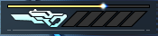
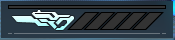
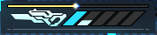
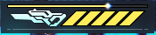
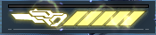
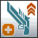
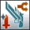

# Skill Tree 

Depicted below is Slayer's skill tree required skill-point allocation.  
Afterward, each skill is explained in detail and with some general tips given when they apply.

## Skill Tree Suggestions

````{admonition} 06/07/23 Patch
:class: attention
The following Skill Tree suggestions do not take the new skill [Gunblade Focus Quick Recharge](./skill-tree.md#gunblade-focus-quick-recharge) into consideration yet.

```{admonition} [Core Skill Tree](https://arks-layer.com/skillsim/ngs/skillcalc.php?29cqIbIVIbIVIbIVIbIVIbIVIbIVIbIVIbIVIbIVIbIV~f~f~f~f~f~f~f~f~f~f~f~f~f~f~f~be~fIq~f~f~f~f~dq~f~f~f~f~f~f~f~f~f~f~f~f~f~f~f~7SYeqIrebererIr~f~f~f~f~f~f~f~f~f~f~f~f~f~f~f~f~f~f~f~f~f~f~a)
:class: tip
If you are unsure which skills you prefer and don't need the Battle Power, spend your points accordingly and you will have 7 Points left over for usage at a later point.
```

```{admonition} [Beginner-Friendly Skill Tree](https://arks-layer.com/skillsim/ngs/skillcalc.php?29cqIbIVIbIVIbIVIbIVIbIVIbIVIbIVIbIVIbIVIbIV~f~f~f~f~f~f~f~f~f~f~f~f~f~f~f~f~dq~f~f~f~f~dq~f~f~f~f~f~f~f~f~f~f~f~f~f~f~f~7SYevererererIr~f~f~f~f~f~f~f~f~f~f~f~f~f~f~f~f~f~f~f~f~f~f~a)
:class: tip
Great Skill Tree for beginners.
```

```{admonition} [Experimental Skill Tree](https://arks-layer.com/skillsim/ngs/skillcalc.php?29cqIbIVIbIVIbIVIbIVIbIVIbIVIbIVIbIVIbIVIbIV~f~f~f~f~f~f~f~f~f~f~f~f~f~f~f~f~dq~f~f~f~f~dq~f~f~f~f~f~f~f~f~f~f~f~f~f~f~f~7SYesereberevIr~f~f~f~f~f~f~f~f~f~f~f~f~f~f~f~f~f~f~f~f~f~f~a)
:class: caution
This skill tree does not have Slug Shot skilled.

To find out more about why click [here](./moveset.md#relevant-gunblade-animation-cancels)

If you are still looking to put a skill point into Slug Shot remove one point of [Gunblade Focus Overflow](./skill-tree.md#gunblade-focus-overflow) for it.
```
````

If you are looking for what subclass and subclass skills to use visit [Subclasses](#subclass)

(core-skills)=
## Core Skills

(gunblade-focus)=
###  Gunblade Focus
Build up the Focus Gauge by hitting enemies. Attack Potency and Offensive {term}`PP` Recovery increase and {term}`PP` Consumption decreases in accordance with the gauge level. The Focus Gauge will reset to zero after a certain amount of time passes without hitting an enemy.

```{csv-table}
---
header: >
  "Skill Level", "Potency Increase Per Level ", "{term}`PP` Consumption Reduction Per Level ", "Offensive {term}`PP` Recovery Per Level "
align: center
---
"1", "1%", "1%", "2%"
```

The UI element at the bottom of your screen helps you identify your current Focus Level and shows you the time that is left until your Focus Level will be reset.

 Focus Reset Indicator: You have recently hit an enemy

 Focus Level 0: You have not gained a level of Focus yet

 Focus Level 1: You have reached one level of Focus

 Focus Level 5: You have reached five levels of Focus

 Focus OD: You have activated Gunblade Focus Overdrive


```{seealso} 500 Focus is needed to reach Focus Level 5. The Focus Level Indicator will turn from blue to yellow.

When Gunblade Focus Overflow was learned the skill will then activate and make it easier for you to gain Rage.

When Gunblade Focus Overdrive was learned you will also be able to activate it.

Gunblade Focus Overdrive is generally treated the same as Gunblade Focus Level 5.
```

###  Gunblade Focus Gauge Amplifier
Increased Focus Gauge charging up to Gunblade Focus Gauge level one.

```{csv-table}
---
header: >
  "Skill Level", "Focus Gauge Increase Rate (Main)", "Focus Gauge Increase Rate (Sub)"
align: center
---
"1", "150%", "120%"
"2", "160%", "125%"
"3", "170%", "130%"
"4", "185%", "140%"
"5", "200%", "150%"
```

###  Gunblade Focus Critical Up
Critical Hit Rate increases according to the Gunblade Focus Gauge level. The Focus Gauge is treated as "at maximum" while Gunblade Focus Overdrive is active.

```{csv-table}
---
header: >
  "Skill Level", "Critical Hit Rate Increase"
align: center
---
"1", "2%"
```

###  Gunblade Focus Overflow
When the Gunblade Focus Gauge is at its maximum level or while Gunblade Focus Overdrive is active, the Unleashed Rage gauge will charge up and its Cooldown time will be reduced.

```{csv-table}
---
header: >
  "Skill Level", "Gauge Accumulation Rate", "Cooldown Reduction"
align: center
---
"1", "110%", "5 sec"
"2", "120%", "5 sec"
"3", "130%", "5 sec"
"4", "140%", "5 sec"
"5", "150%", "5 sec"
```

###  Gunblade Focus Overdrive
[_Active Skill_](./moveset.md#gunblade-focus-overdrive)

Expend your entire full Focus Gauge to temporarily increase the effects of Gunblade Focus. Using the skill again while it is active will unleash a powerful attack.

```{csv-table}
---
header: >
  "Skill Level", "Effect Duration", "Cooldown", "Potency", "{term}`PP` Consumption", "{term}`PP` Recovery", "Finisher Potency"
align: center
---
"1", "30 sec", "90 sec", "110%", "80%", "150%", "2450"
```

###  Gunblade Focus Quick Recharge

The Gunblade Focus gauge charge rate temporarily increases after the effects of Gunblade Focus Overdrive have ended.

```{csv-table}
---
header: >
  "Skill Level", "Focus Gauge Boost Rate", "Effect Duration"
align: center
---
"1", "120%", "20 sec"
```

###  Unleashed Rage
[_Active Skill_](./moveset.md#unleashed-rage)

Build up the gauge with Photon Arts and/or Relentless Blade, then expend it to fire a single powerful blast.

```{csv-table}
---
header: >
  "Skill Level", "Potency", "Cooldown"
align: center
---
"1", "1000%", "20 sec"
```

###  Unleashed Rage After Effect
Temporarily increases Critical Hit Rate after activating Unleashed Rage.

```{csv-table}
---
header: >
  "Skill Level", "Critical Hit Rate Increase", "Effect Duration"
align: center
---
"1", "5%", "20 sec"
```

###  Blade Counter
When you successfully negate an attack using a Weapon Action, using a Normal Attack or Weapon Action will unleash a counter. The counter varies depending on which you use.

###  Blade Counter Critical Up
Increases Blade Counter's Critical Hit Rate.

```{csv-table}
---
header: >
  "Skill Level", "Critical Hit Rate Increase"
align: center
---
"1", "5%"
```

###  Mobile Blade
Activating the weapon action while performing a directional input will cause invincibility frames to occur, and change the attack behavior while moving.

###  Mobile Blade Counter
When you successfully dodge using Mobile Blade, using a Normal Attack or Weapon Action will unleash a counter. The counter varies depending on which you use.

###  Critical Up
Increases Critical Hit Rate.

```{csv-table}
---
header: >
  "Skill Level", "Critical Hit Rate Increase (Main)","Critical Hit Rate Increase (Sub)"
align: center
---
"1", "0.50%", "0.20%"
"2", "1.00%", "0.40%"
"3", "1.50%", "0.60%"
"4", "2.00%", "0.80%"
"5", "2.50%", "1.00%"
"6", "3.00%", "1.20%"
"7", "3.25%", "1.40%"
"8", "3.50%", "1.60%"
"9", "3.75%", "1.80%"
"10", "4.00%", "2.00%"
"11", "4.20%", "2.20%"
"12", "4.40%", "2.40%"
"13", "4.60%", "2.60%"
"14", "4.80%", "2.80%"
"15", "5.00%", "3.00%"
```

###  Gallant Attack Critical Up
Increases Critical Hit Rate when attacking boss enemies.

```{csv-table}
---
header: >
  "Skill Level", "Critical Hit Rate Increase (Main)","Critical Hit Rate Increase (Sub)"
align: center
---
"1", "1.00%", "0.20%"
"2", "2.00%", "0.40%"
"3", "3.00%", "0.60%"
"4", "4.00%", "0.80%"
"5", "4.20%", "1.00%"
"6", "4.40%", "1.20%"
"7", "4.60%", "1.40%"
"8", "4.80%", "1.60%"
"9", "4.90%", "1.80%"
"10", "5.00%", "2.00%"
```

###  Short Range Hot Shot
Increases Potency when you hit an enemy with a Normal Attack at close range.

```{csv-table}
---
header: >
  "Skill Level", "Potency"
align: center
---
"1", "130%"
```

###  Charged Blade
Pressing the Weapon Action button at just the right time after a charged Normal Attack will unleash a thrust attack.

###  Relentless Blade
Pressing the Normal Attack button at just the right time while performing a Photon Art will allow you to perform an additional attack.

###  Relentless Blade Reinforce
Increases Relentless Blade Potency.

```{csv-table}
---
header: >
  "Skill Level", "Potency"
align: center
---
"1", "500%"
```

(optional-skills)=
## Optional Skills

These are the skills you dump the rest of your skill points into after taking all the [Core Skills](#core-skills).

###  Critical Hit PP Gain
There is a chance of recovering {term}`PP` when you land a Critical Hit.

```{csv-table}
---
header: >
  "Skill Level", "Activation Probability","{term}`PP` Recovery (Main)","{term}`PP` Recovery (Sub)", "Cooldown"
align: center
---
"1", "30%", "+4", "+2", "1 sec"
"2", "50%", "+4", "+2", "1 sec"
"3", "70%", "+4", "+2", "1 sec"
"4", "85%", "+4", "+2", "1 sec"
"5", "100%", "+4", "+2", "1 sec"
```

###  Gunblade Focus Reset PP Gain
When the Gunblade Focus Gauge is reset, recover an amount of {term}`PP` in accordance with the Focus Gauge level.

```{hint} 
This skill also activates when entering [Gunblade Focus Overdrive](./skill-tree.md#gunblade-focus-overdrive)
```

```{csv-table}
---
header: >
  "Skill Level", "{term}`PP` Recovery Rate Per Level (Main)","{term}`PP` Recovery Rate Per Level (Sub)"
align: center
---
"1", "10.00%", "5.00%"
"2", "12.00%", "6.00%"
"3", "14.00%", "7.00%"
"4", "17.00%", "8.50%"
"5", "20.00%", "10.00%"
```

###  Slug Shot
Pressing the Normal Attack Button without inputting a direction right after performing a Photon Art will unleash a short-range shot.

```{raw} html
<meta content="Slayer Skill Tree" property="og:title">
<meta content="How to allocate skill points in the Slayer Skill Tree, and a brief explanation of each skill with some tips along the way." property="og:description">
<meta content="https://ngs-slayers.github.io/skill-tree.html" property="og:url">
<meta content="https://ngs-slayers.github.io/_static/class/UINGSClassSl.png" property="og:image">
<meta content="#48AC9C" data-react-helmet="true" name="theme-color">
```